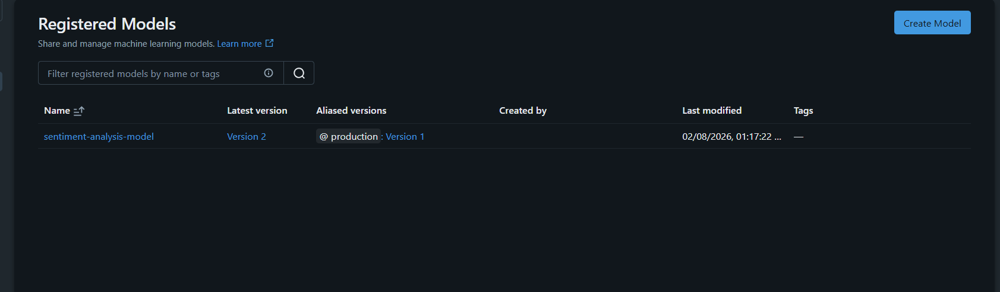
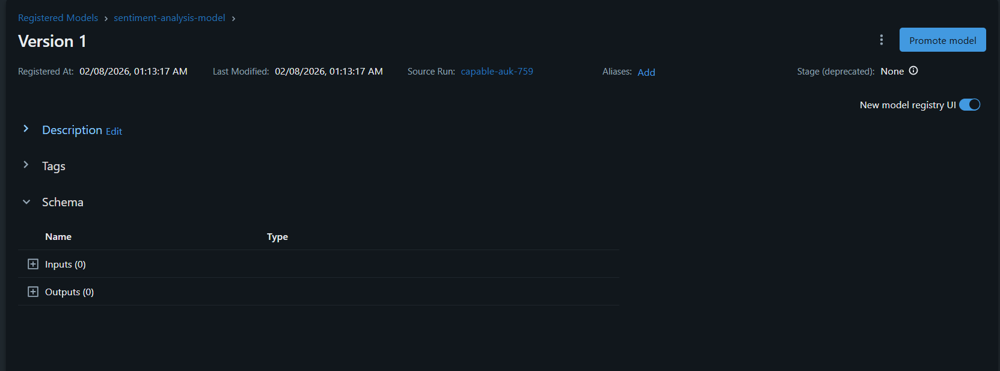
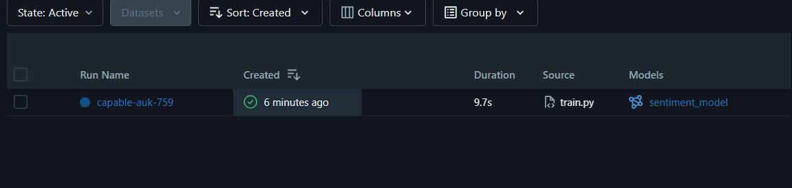
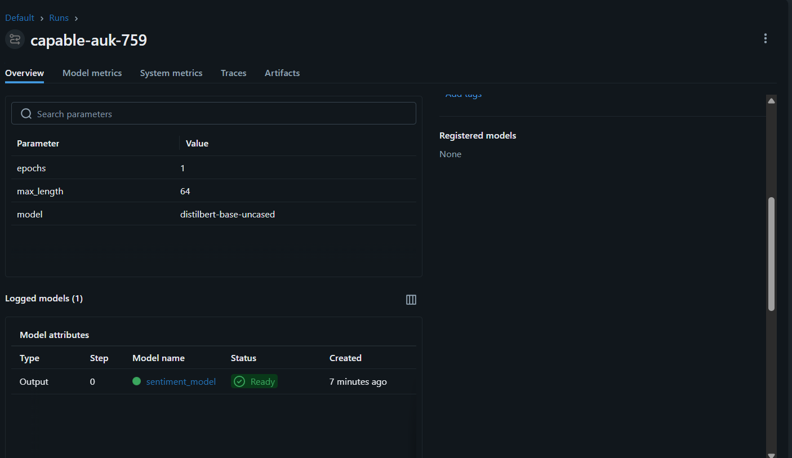
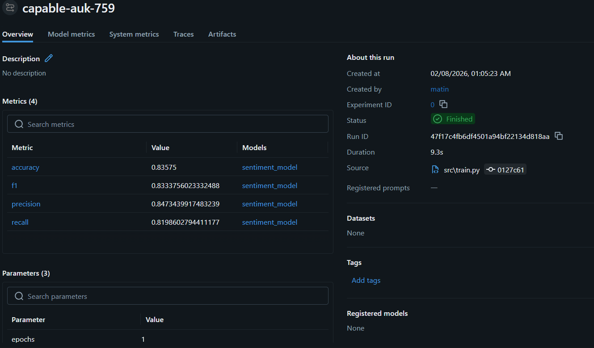

# End-to-End MLOps Sentiment Analysis System 🚀

This project demonstrates a **complete, production-ready MLOps pipeline** for **sentiment analysis** using **Transformer-based NLP**, **MLflow**, **FastAPI**, and **Docker**.

It covers the **entire ML lifecycle** — from training and experiment tracking to model registry, production promotion, and deployment.

---

## 🔍 Problem Statement

Automatically classify movie reviews as **Positive** or **Negative** using Natural Language Processing (NLP), and deploy the solution following **real-world MLOps best practices**.

---

## 🧠 Model & Approach

- **Model**: DistilBERT (`distilbert-base-uncased`)
- **Task**: Binary sentiment classification
- **Why DistilBERT?**
  - Faster inference than BERT
  - CPU-friendly
  - Widely used in production NLP systems

---

## 📊 Model Performance (Tracked via MLflow)

| Metric | Value |
|------|------|
| Accuracy | ~0.84 |
| Precision | ~0.85 |
| Recall | ~0.82 |
| F1-score | ~0.83 |

All metrics are **logged, versioned, and reproducible** using MLflow.

---

## 🧪 Experiment Tracking (MLflow)

Each training run logs:
- Model parameters (epochs, model name, etc.)
- Evaluation metrics (accuracy, precision, recall, F1)
- Trained model artifacts

This enables:
- Comparison between experiments
- Reproducibility
- Data-driven deployment decisions

---

## 🏷️ Model Registry & Versioning

- Models are registered in **MLflow Model Registry**
- Multiple versions are maintained
- A **`production` alias** explicitly points to the deployed model

This provides:
- Clear model governance
- Safe promotion & rollback
- Traceability from training to deployment

---

## 🖼️ MLflow Screenshots

### Production Model (Alias-based Promotion)

### Model Version Details

### Training Run Metrics

### Experiment Runs Overview

---

## 🌐 Model Deployment (FastAPI)

The trained model is exposed as a **REST API**.

### Endpoint

POST /predict

### Request

{
  "text": "The movie was amazing"
}

### Response
{
  "sentiment": "Positive",
  "confidence": 0.87
}

The API is stateless and can be consumed by:

Web / mobile applications

Backend services

Batch processing jobs

🐳 Dockerized Deployment

The entire inference service is fully containerized.

Why Docker?

Eliminates environment inconsistencies

Ensures reproducible deployments

Enables easy scaling and rollback

Industry standard for production ML systems

Build Image
docker build -t sentiment-mlops:1.0 .

Run Container
docker run -p 8000:8000 sentiment-mlops:1.0

Access Swagger UI:

http://127.0.0.1:8000/docs

✅ The container runs independently of the project source code.

📈 Monitoring & Drift Strategy (Design)

Inference metadata (prediction confidence, input statistics) is logged

Production data is periodically compared with training data

Data drift triggers retraining decisions

New models are evaluated and promoted using MLflow

This completes the Train → Deploy → Monitor → Retrain lifecycle.

🧩 Project Structure
sentiment-mlops/
│
├── app/              # FastAPI inference service
├── src/              # Training pipeline
├── Dockerfile
├── requirements.txt
├── screenshots/      # MLflow UI screenshots
└── README.md

🎯 Key MLOps Concepts Demonstrated

Transformer-based NLP modeling

Experiment tracking with MLflow

Model registry & versioning

Production model promotion using aliases

REST API deployment

Dockerized inference service

Rollback & retraining strategy

👤 Author

Matin Raheman Nadaf
B.Tech in Computer Science & Engineering
Focus: MLOps, NLP, Production ML Systems
